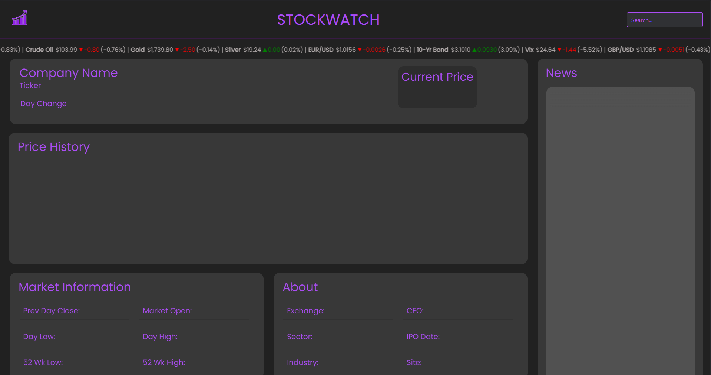

# StockWatch
---
---
### [Deployed Link](https://smandla.github.io/stockwatch/).


## Table of Contents


* [Installation](#installation)
* [Usage](#usage)
* [Credits](#credits)
* [License](#license)

## Description 

The stock market is a constantly changing stream of data that requires a careful watch. Whether you have shares in a company or are just trying to get a sense of the economy, you’ll need some place to quickly check the basic information of the stock market. It’s not only important to keep an eye on the basic information such as the big-name indexes everyone relies on, but also the specific information of the companies you might be heavily invested in. Their stock price (highs and lows), and volume sold need to be accessible at a glance, as well as how that information changes over time. Perhaps most critically, any prospective stock watcher needs to keep an eye on the breaking news for companies they are invested in. 

With all the basic information plus the ability to search for specific companies’ vital stock market data and news headlines, this site provides a way for users to quickly and conveniently get caught up on what’s happening in the market, and what might be happening in the future. Of course, more specific data analysis might be needed, but Stock Watch provides a visually clean way to keep up to date on the most crucial information. 

The site makes use of stockdata.com API for its site data, processes it into a convenient candle chart with the Highcharts library, and provides current news on searched companies with the New York Times API. 


## Installation

Clone repository and run on local machine or use deployed link above


Provide instructions and examples for use. Include screenshots as needed. 
## Usage 

On page initialization, the page will look like the following:


To use this application, please use search bar to search fro either a US based stock ticker or company.  
Upon searching, the webpage will pull information from the Yahoo API to earch for the appropriate ticker/names
```ruby
const getTicker = async (input) => {
  const response = await fetch(
    `https://yfapi.net/v6/finance/autocomplete?region=US&lang=en&query=${input}`,
    {
      headers: {
        "x-api-key": `${yahooAPIKey}`,
      },
    }
  );
  const data = await response.json();
  if (data.ResultSet.Result[0] === undefined) {
    badSearchModalEl.addClass("is-active");
  }
  symbol = data.ResultSet.Result[0].symbol;
  companyName = data.ResultSet.Result[0].name;
  getNewsData(companyName);
  fetchStockRealTime(symbol);
  fetchStockEODHistorical(symbol);
  getInfo(symbol);
}
```
Upon receiving the api call, we parse out the relevant data. Company Name and its respective symbol. We the use that information to call on otehr functions to generate the webpage elements to look like this:


We utilize the information from the Yahoo API to make other API calls to [StockData's API](https://www.stockdata.org/) 
(for realtime pricing and market information as well as historical data for the candlestick Chart), 
[Finacial Modeling Prep's API](https://site.financialmodelingprep.com/) (for company information in the About Section) 
as well as the [New York Times' API](https://developer.nytimes.com/)(News section on the right).
It will also locally keep a record of your recent searches. For the news section on the right, it take information on the right


---
## Credits:


### Created by:

[Kavya Mandla](https://github.com/smandla)   
[Abdur-Rauf Ahmed](https://github.com/Corasinth)  
[Maverick Wong](https://github.com/maverickwong17)

### With the Help of:

[JQuery](https://jquery.com/) |
[Javascript](https://www.javascript.com/) |
[Bulma](https://bulma.io/) | 
[Highcharts](https://www.highcharts.com/) | 
[Yahoo Finace API](https://www.yahoofinanceapi.com/) | 
[StockData API](https://www.stockdata.org/) |
[New York Times   API](https://developer.nytimes.com/) |
[Finacial Modeling Prep API](https://site.financialmodelingprep.com/) |
[Figma](https://www.figma.com/) |

### Logo from:  
[Tailor Brands](https://www.tailorbrands.com/)

### Documentation:z
[MDN Web docs](https://developer.mozilla.org/en-US/) | 
[W3 Schools](https://www.w3schools.com/) | 
[Stack Overflow](https://stackoverflow.com/) |

---
## License

MIT License